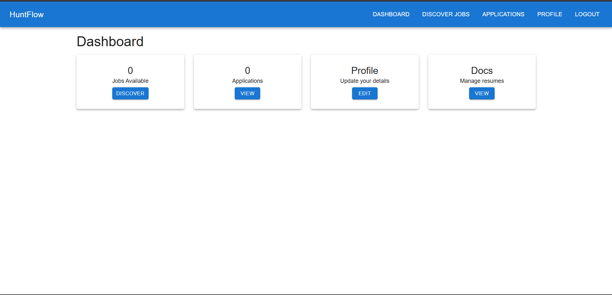

# HuntFlow 🤖

**HuntFlow** is an all-in-one job hunt companion: aggregate jobs, analyze your CV, track applications, and apply faster with a clean pipeline dashboard.

## ⚙️ Tech Stack
- **Stack**: MERN
- **Frontend**: React, Tailwind CSS
- **Backend**: Node.js, Express
- **Database**: MongoDB
- **AI Integration**: Python-based algorithms for CV analysis, job matching, and application automation
- **Subscription & Payments**: Razorpay
- **Deployment**: Vercel for the frontend, and AWS for backend services

## 🚀 Features

- **Job Aggregation & Search** 💡: Collects and organizes job listings from multiple sources and helps you find relevant roles faster.
- **CV Analyzer** 🧠: Analyzes your resume, highlights gaps, and helps tailor it to job requirements.
- **Application Tracking Pipeline** 📊: Track applications by stage (saved → applied → interview → offer) with a clean dashboard.
- **Faster Apply Workflow** ⚡: Streamlines applications so you can apply quicker and stay consistent.

## 💼 Application Workflow

The workflow is designed to be simple and fast. Here are some visuals to illustrate the process:

  
*End-to-end job hunt workflow*

  
*Pipeline dashboard for analytics and tracking*

## 🛠️ Installation

To set up HuntFlow locally, follow these steps:

1. **Clone the Repository**:

   ``
   git clone https://github.com/MohamedBoghdaddy/hkiiapply.git
   cd hkiiapply
``

2. **Install Dependencies**:

   * **Backend**:

     ``
     cd backend
     npm install
     ``

   * **Frontend**:

     ``
     cd ../frontend
     npm install
     ``

3. **Set Up Environment Variables**:

   Create a `.env` file in the backend directory with the following:

   ```env
   MONGO_URI=your_mongodb_uri
   JWT_SECRET=your_jwt_secret
   RAZORPAY_API_KEY=your_razorpay_api_key
   ```

4. **Start the Application**:

   * **Backend**:

     ``
     npm start
     ``

   * **Frontend**:

     ``
     cd ../frontend
     npm start
     ``

   The frontend should now be running on `http://localhost:3000` and the backend on `http://localhost:5000`.

## 💻 Usage

1. **Register and Subscribe**: Sign up and choose a subscription plan (if enabled).
2. **Import/Set Preferences**: Define job titles, locations, and filters.
3. **Track & Apply**: Use the pipeline dashboard to manage applications, review CV feedback, and apply faster.

## 📜 License

This project is licensed under the MIT License. See the [`LICENSE`](LICENSE) file for more details.

---

**HuntFlow** helps you stay organized and move faster: discover jobs, refine your CV, and track every application in one place.
